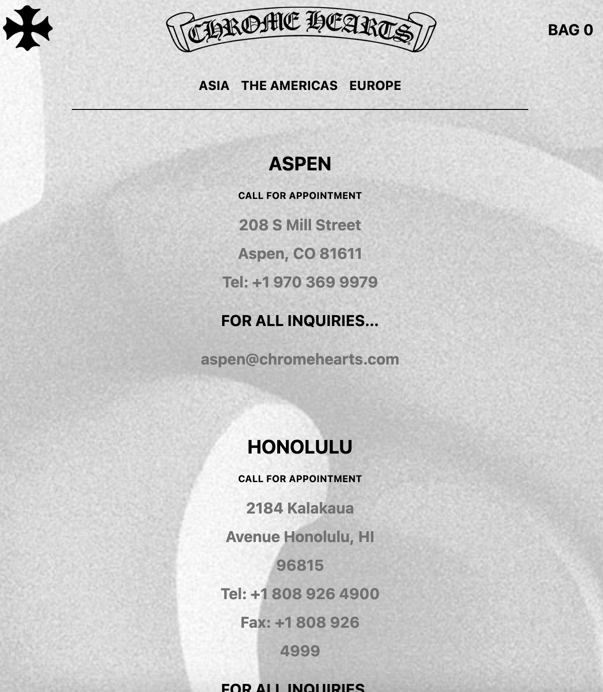

# Procesverslag
Markdown is een simpele manier om HTML te schrijven.  
Markdown cheat cheet: [Hulp bij het schrijven van Markdown](https://github.com/adam-p/markdown-here/wiki/Markdown-Cheatsheet).

Nb. De standaardstructuur en de spartaanse opmaak van de README.md zijn helemaal prima. Het gaat om de inhoud van je procesverslag. Besteedt de tijd voor pracht en praal aan je website.

Nb. Door *open* toe te voegen aan een *details* element kun je deze standaard open zetten. Fijn om dat steeds voor de relevante stuk(ken) te doen.

## Jij

  
uitwerken voor kick-off werkgroep

  ### Auteur:
  Rosalie Groen

  #### Je startniveau:
  Blauw

  #### Je focus:
  surface plane

(- Video/Geluid
-  Dark/Light mode 
- Toegankelijkheid++
- Formulieren
- Advanced positioning: sticky, fixed, z-index…)
 

## Je website

  
uitwerken voor kick-off werkgroep

  ### Je opdracht:
  https://www.chromehearts.com

  #### Screenshot(s) van de eerste pagina (small screen): 
  https://www.chromehearts.com/scents#
  
  

  #### Screenshot(s) van de tweede pagina (small screen):
  https://www.chromehearts.com/locations.html
  
 

## Toegankelijkheidstest 1/2 (week 1)

  
uitwerken na test in 1e werkgroep

  ### Bevindingen
  Lijst met je bevindingen die in de test naar voren kwamen:

  #### Screenreader
  Als je de screenreader op alleen links zette, werd het menu niet voorgelezen omdat het menu met javascript was gemaakt en niet met links.
  Zo kan je als blind persoon niet door het menu.

  Dit toegangelijkheidsprobleem kan worden opgelost door het menu met links te maken ipv javascript. (met indien nodig afbeeldingen)

  #### Muis en Toetsenbord 
  Hier was geen groot probleem. 
  
  Wat eventueel wel handig zou zijn zijn grotere knoppen voor de nagellak kleuren want die zijn nu vrij klein
  en moeilijk te gebruiken voor mensen met een motorieke beperking.

  #### Motoriek (shocks, elastiekjes)
  Dit was niet een groot probleem omdat als je bijvoorbeeld op een item wou klikken je op de image kan klikken. Deze werkt als een link naar een detailpagina voor de parfum items.

  #### Visueel (brillen, contrast, kleurenblind, dark/light). 
  Er waren eigenlijk geen problemen op dit oppervlak. Bij de nagellak was alleen wel het probleem 
  dat bij de verschillende knoppen van verschillende kleuren nagellak, er geen naam van de kleur bij stond. Zo kunnen blinde mensen en kleurenblinde mensen het niet zien.

  Dit kan opgelost worden door een benaming bij de kleuren te zetten voor kleurenblinde mensen en 
  een "alt" text voor screenreaders als een blind persoon gebruik maakt van de site.

## Breakdownschets (week 1)

  
uitwerken na afloop 2e werkgroep

  ### de hele pagina: 
  van de scents pagina
  

  van de locations pagina
  

  ### dynamisch deel (bijv menu): 
  

  ### wellicht nog een dynamisch deel (bijv filter): 
  

## Voortgang 1 (week 2)

  
uitwerken voor 1e voortgang

  ### Stand van zaken
  

  ### Agenda voor meeting
  Hoe maak ik het toegangelijker
  
  ### Verslag van meeting
  hier na afloop snel de uitkomsten van de meeting vastleggen

  -aria labels gebruiken
  -h1 gebruiken asl kopjes voor verschillende sections voor de screenreaders.
  -alle waardes die nog nog em zijn omzetten in pixels.

## Voortgang 2 (week 3)

  
uitwerken voor 2e voortgang

  ### Stand van zaken
  Ik heb de achtergrond gekregen en toe kunnen voegen. Ook heb ik met behulp van Sanne
  het menu op de locations pagina sticky gemaakt zodat de content er onder door kan scrollen.

  ### Agenda voor meeting
  achtergrond, uitklapmenu

  ### Verslag van meeting
  hier na afloop snel de uitkomsten van de meeting vastleggen

  - iedereen is verder gekomen
  - de achtergrond krijg ik nog van Sanne zodat ik die kan gebruiken
  - Het uitklapmenu kan ik maken met behulp van de opdracht op github
  - sections aangeven met onzichtbare kopjes voor screenreaders(h1)

## Toegankelijkheidstest 2/2 (week 4)

  
uitwerken na test in 8e werkgroep

  ### Bevindingen
  Lijst met je bevindingen die in de test naar voren kwamen (geef ook aan wat er verbeterd is):

  #### Screenreader
  De screenreader las het menu en de h1's dus dit is verbeterd. Ik ben erg blij met het resultaat.

  #### Muis en Toetsenbord 
  Je kon goed door alles heen tabben.

  #### Motoriek (shocks, elastiekjes)
  de knoppen van de nagellak moeten nog groter dat had ik nog niet gedaan. Hierdoor kan je
  er moeilijk(er) op klikken.

  #### Visueel (brillen, contrast, kleurenblind, dark/light). 
  Hier zijn geen problemen alleen moet ik nog tekst toevoegen aan de buttons voor de kleuren.

## Voortgang 3 (week 4)

  
uitwerken voor 3e voortgang

  ### Stand van zaken
  Het uitklapmenu is gelukt dus daar ben ik heel blij mee. Ook is de sticky gelukt voor de locations pagina.

  ### Agenda voor meeting
  erg veel gedoe met positionering dus dat zeker fixen.
  
  ### Verslag van meeting
  - extra content toevoegen. namelijk een log in formulier en een kledingstuk
  - locations pagina moet verder worden vormgegeven
  - werken aan darkmode
  - dat de positionering niet werkte lag aan een niet afgesloten link dus nu is alles goed.

## Eindgesprek (week 5)

  
uitwerken voor eindgesprek

  ### Je uitkomst - karakteristiek screenshots:
  
  
  
  
  

  ### Dit ging goed/Heb ik geleerd: 
 Ik heb zeker meer geleerd over javascript. Ik vond dit eerst echt heel lastig maar nu ik het snap is 
 het eigenlijk helemaal niet moeilijk. Ik heb de knoppen van de verschillende kleuren nagellak met javascript laten werken

 

  ### Dit was lastig/Is niet gelukt:
  wat ik nog wel lastig vond was het positioneren van de video als een achtergrond met het menu er over heen.
  Ik heb hem position:absolute; gegegeven maar nu kan je niet echt de controls van de video bedienen.
  Je kan dit wel met tab.
 
 

## Bronnenlijst

  
continu bijhouden terwijl je werkt

bronnen van foto's, de video en code heb ik in mijn html als comments er in gezet. Zo weet je heel makkelijk
welke bronnen in welke stukjes terug komen.

